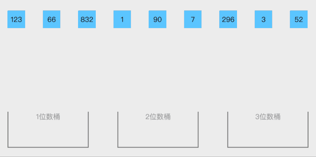

<h1 align="center">希尔排序</h1>

> 阿秀自己刷过的算法部分经过整理后是按照不同基础、不同人群分类的，如果你不知道自己该看哪个部分的算法题，可以先看一下这里，[戳我直达](/notes/03-hunting_job/03-algorithm/01-basic-algorithm/01-introduce.md)。

## 希尔排序

希尔排序可以说是插入排序的一种变种。无论是插入排序还是冒泡排序，如果数组的最大值刚好是在第一位，要将它挪到正确的位置就需要 n - 1 次移动。也就是说，原数组的一个元素如果距离它正确的位置很远的话，则需要与相邻元素交换很多次才能到达正确的位置，这样是相对比较花时间了。

希尔排序就是为了加快速度简单地改进了插入排序，交换不相邻的元素以对数组的局部进行排序。

希尔排序的思想是采用插入排序的方法，先让数组中任意间隔为 h 的元素有序，刚开始 h 的大小可以是 h = n / 2,接着让 h = n / 4，让 h 一直缩小，当 h = 1 时，也就是此时数组中任意间隔为1的元素有序，此时的数组就是有序的了。

为方便理解我还准备了图片：

如果还是不懂的话我还给你准备了优质的文章讲解：https://mp.weixin.qq.com/s/4kJdzLB7qO1sES2FEW0Low

~~~cpp

void shellSortCore(vector<int>& nums, int gap, int i) {
	int inserted = nums[i];
	int j;
    //  插入的时候按组进行插入
	for (j = i - gap; j >= 0 && inserted < nums[j]; j -= gap) {
		nums[j + gap] = nums[j];
	}
	nums[j + gap] = inserted;
}

void shellSort(vector<int>& nums) {
	int len = nums.size();
    //进行分组，最开始的时候，gap为数组长度一半
	for (int gap = len / 2; gap > 0; gap /= 2) {
        //对各个分组进行插入分组
		for (int i = gap; i < len; ++i) {
            //将nums[i]插入到所在分组正确的位置上
			shellSortCore(nums,gap,i);
		}
	}

	for (auto a : nums) {
		cout << a << "";
	}

}
~~~

